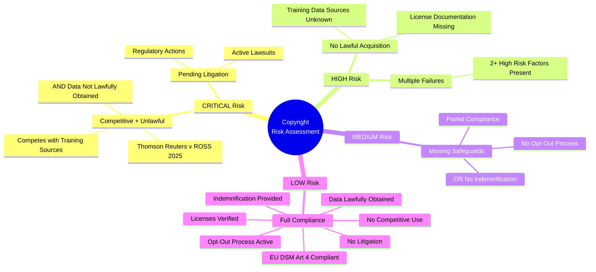

# AI Use Case Context Framework -- Mind Map

## Complete Framework

```mermaid
mindmap
  root((AI Use Case<br/>Context Framework))
    Core Governance
      UseCaseContext
        name / description
        workflow_phase
        tags
        risk_flags
        routing_table
        flag_risk()
        is_blocked()
        get_blockers()
        risk_score()
        summary()
      RiskDimension
        Legal / IP Ownership
        Bias / Fairness
        Safety / Harmful Output
        Security / Model Integrity
        Technical Feasibility
        Output Quality
        Custom Dimensions
      RiskLevel
        NONE 0
        LOW 1
        MEDIUM 2 -- Review
        HIGH 3 -- Blocks
        CRITICAL 4 -- Escalates
      RiskFlag
        dimension
        level
        reviewer
        status lifecycle
          OPEN
          IN_REVIEW
          RESOLVED
          ACCEPTED
          BLOCKED
    Compliance Standards
      ISO/IEC 42001
        AIMS Structure
        Plan-Do-Check-Act
        Annex A Controls x25
          Bias and Fairness
          Transparency
          Accountability
          Data Governance
          Supply Chain Security
        Maturity Levels
          Initial
          Managed
          Defined
          Quantitatively Managed
          Optimizing
        Certification Tracking
      NIST AI RMF
        GOVERN 30%
          Policies
          Roles
          Committee
          Risk Tolerance
        MAP 25%
          Context
          Risk Categories
          Third-Party Risks
          Community Impacts
        MEASURE 25%
          Performance Metrics
          Fairness / Bias
          Reliability
          Security Testing
        MANAGE 20%
          Response Strategies
          Incident Tracking
          Drift Monitoring
          Decommissioning
        AI 600-1 GenAI Supplement
      EU AI Act
        Risk Tiers
          Unacceptable -- Banned
          High -- Strict Obligations
          Limited -- Transparency
          Minimal -- No Obligations
        GPAI Obligations
          Training Data Summary
          Copyright Opt-Out Policy
          Transparency Disclosure
        High-Risk Extras
          Conformity Assessment
          Fundamental Rights Impact
          Human Oversight
        Penalties to 15M EUR / 3%
      MovieLabs OMC
        Software-Defined Workflow
        Cloud-Native Architecture
        Interoperable Data Model
        Security-First Design
        Asset Provenance Tracking
        Component-Based Pipeline
        Open API Interfaces
        Rights Management
    Data Provenance
      DataSource
        URL / Name
        Collection Date
        License Type
        License Compliance
          Verified
          Pending Review
          Non-Compliant
          Unknown
        Capture Method
          Motion Capture
          LIDAR
          FACS
          Volumetric
          Photogrammetry
          Web Crawl
          Partner Feed
          Sensor
          Manual Creation
          Synthetic
          Licensed Dataset
          API
        Copyright Holder
        Opt-Out Honored
        Consent Documented
      Generation Flags
        HUMAN_ORIGIN
        HYBRID
        MACHINE_ORIGIN
        UNKNOWN
        Confidence Score 0-1
      Transformation Logs
        Deduplication
        Cleaning
        OCR
        Translation
        Augmentation
        Normalization
        Filtering
        Anonymization
        Input/Output Hashes
      Bi-Temporal Versioning
        valid_from / valid_to
        recorded_at
        parent_version_id
        Checksum
        Record Count
      Provenance Card
        Aggregates All Lineage
        License Summary
        Lawful Basis
        Synthetic Percentage
        Audit-Ready Document
      Model Collapse Guard
        Max Synthetic Cap
        Actual Synthetic %
        Vendor Disclosure
        High-Stakes Domain
        Violation Detection
    Vendor Scorecard
      Six Dimensions
        Data and Provenance 25%
        Governance and Security 20%
        Ethics and Compliance 20%
        Technical Fit 15%
        Commercial Terms 10%
        Operating Model 10%
      Vendor Tiers
        Preferred >= 80
        Approved >= 60
        Conditional >= 40
        Not Approved < 40
      KBYUTS Scoring
        Training Data Transparency
        Creative Professional Treatment
        Governance Maturity
        Output Attribution
        Legal Risk
      Copyright Assessment
        Lawfully Obtained
        License Verification
        Opt-Out Compliance
        Indemnification
        Competitive Use Risk
        Pending Litigation
        Thomson Reuters Precedent
        EU DSM Article 4
      Essential Questions x15
        Encryption Standards
        Certifications
        Bias Frameworks
        Data Lineage
        Client Data Policy
        Model Drift
        Synthetic Data %
        Indemnification
        Opt-Out Process
    Security Profiles
      TPN Pack
        Content Security
        Physical Security
        Digital Security
        Asset Management
        Incident Response
        Personnel Security
      VFX Pack
        Secure Transfer
        Render Farm Isolation
        Workstation Security
        Cloud / Hybrid Security
        Data Classification
        Vendor Security
      Enterprise Pack
        Access Control IAM
        Audit Trail / Logging
        Data Privacy GDPR/CCPA
        Regulatory Compliance
        Business Continuity / DR
      Composable Profiles
        security_profile()
        apply_security_profile()
        register_preset()
    Governance Hooks
      GovernanceEvent
        event_type
        use_case_name
        dimension / level
        actor
        timestamp
        metadata
      Built-In Adapters
        AuditLogger
          In-Memory Log
          Pluggable Sink
          Queryable
        ComplianceGate
          Named Criteria
          Pass / Fail
          Auto-Emit Events
        NotificationBridge
          Webhook / SIEM
          Event Filter
          Callback
    Infrastructure
      Dashboard
        Portfolio Overview
        Risk Heatmap
        Reviewer Workload
        Workflow Phase Grouping
      Escalation Policy
        LOW 7d to MEDIUM
        MEDIUM 3d to HIGH
        HIGH 1d to CRITICAL
        CRITICAL 4h Re-Notify
      Serialization
        to_dict / from_dict
        to_json / from_json
        Full Round-Trip
        Custom Dimensions Preserved
      Web UI
        Flask Dashboard
        Score Reports
        Flag Management
        Security Profiles Page
```

## Evaluation Pipeline

```mermaid
mindmap
  root((Evaluation<br/>Pipeline))
    Step 1 -- Setup
      Create UseCaseContext
      Apply Security Profiles
      Set Workflow Phase and Tags
    Step 2 -- Compliance
      Assess ISO 42001
        AIMS Documented?
        Controls Implemented?
        Impact Assessment Done?
      Map NIST AI RMF
        Score Four Functions
        Committee Established?
        GenAI Supplement?
      Check EU AI Act
        Risk Classification
        EU Distribution?
        Training Summary Published?
        Opt-Out Policy?
      Align MovieLabs OMC
        Eight Principles
        Workflow Phase Match
      evaluate_compliance()
        ComplianceResult
        Section Scores
        Gaps and Recommendations
    Step 3 -- Provenance
      Document Sources
        Metadata per Source
        License Compliance
        Capture Method
      Classify Generation
        Human / Machine / Hybrid
        Confidence Score
      Log Transformations
        Ordered Records
        Input/Output Hashes
      Version Datasets
        Bi-Temporal Fields
        Lineage Chain
      Build Provenance Card
      Set Model Collapse Guard
        Synthetic Cap
        Vendor Disclosure
      evaluate_provenance()
        Provenance Score
        Lineage Gaps
    Step 4 -- Vendor Scoring
      Score Six Dimensions
        Each 0 to 100
        Custom Weights
      Assess KBYUTS
        Five Criteria
        Composite Score
      Evaluate Copyright Risk
        Thomson Reuters Test
        Litigation Check
        Indemnification
      evaluate_vendor()
        Overall Score
        Tier Assignment
        Copyright Risk Level
    Step 5 -- Risk Flags
      Compliance Gaps to Flags
      Provenance Gaps to Flags
      Vendor Gaps to Flags
      Auto-Route to Reviewers
    Step 6 -- Decision
      Blocked or Clear?
      Route Blockers
      Set Remediation Timeline
    Step 7 -- Artifacts
      Serialize All Results
      JSON Round-Trip
      Audit Trail
      Dashboard Registration
```

## Copyright Risk Decision Map


