# Governance, Provenance, and Vendor Scorecard Guide

> Usage documentation for the three governance modules added in alignment
> with 2025 best practices for AI governance frameworks, data provenance
> standards, and vendor scorecard methodologies.

## Table of Contents

- [Architecture Overview](#architecture-overview)
- [1. Compliance Standards Module](#1-compliance-standards-module)
- [2. Data Provenance Module](#2-data-provenance-module)
- [3. Vendor Scorecard Module](#3-vendor-scorecard-module)
- [4. End-to-End Workflow](#4-end-to-end-workflow)
- [5. Integration Patterns](#5-integration-patterns)
- [6. Quick Reference](#6-quick-reference)

---

## Architecture Overview

The three new modules extend the core governance framework. Each evaluates
a different aspect of AI risk and feeds results into `UseCaseContext` as
risk flags.

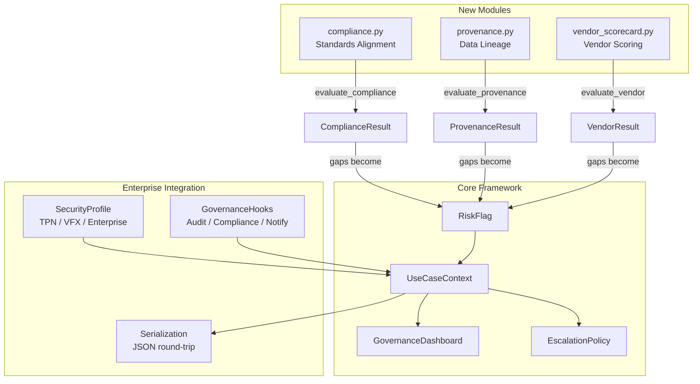

### Data Flow

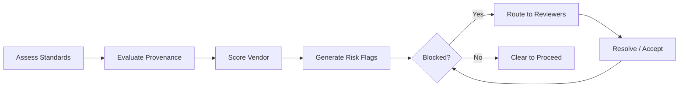

---

## 1. Compliance Standards Module

**Module:** `ai_use_case_context/compliance.py`

Evaluates alignment with four international standards through a single
`ComplianceProfile` that aggregates all assessments.

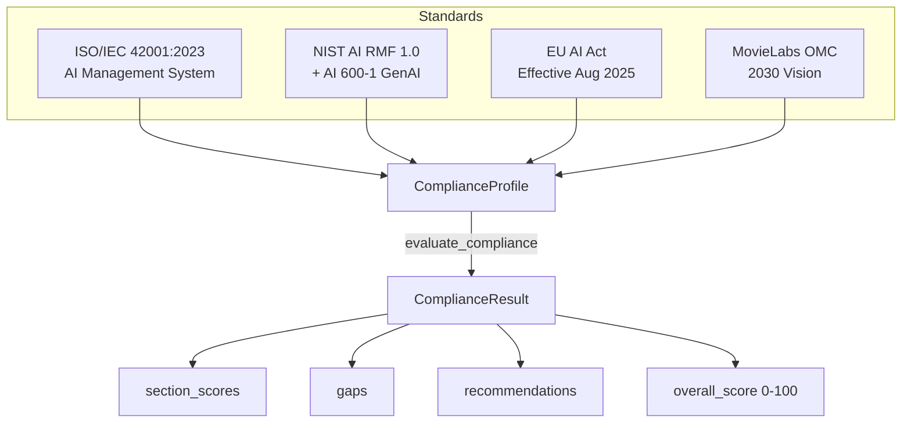

### 1.1 ISO/IEC 42001:2023 -- AI Management System

The international benchmark for AI management. Uses a Plan-Do-Check-Act
methodology with 38 Annex A controls.

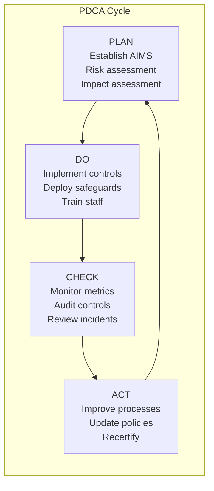

**Annex A Control Categories:**

| Category | Controls | Scope |
|----------|----------|-------|
| A.2 | AI Policy | Organizational policies and responsibilities |
| A.3 | Risk Management | Risk assessment and treatment |
| A.4 | System Lifecycle | Impact assessment, testing, deployment, monitoring |
| A.5 | Ethics | Bias/fairness, transparency, accountability, privacy |
| A.6 | Data Governance | Provenance, quality management |
| A.7 | Supply Chain | Third-party components, AI supply chain security |
| A.8 | Security | System security, model protection |
| A.9 | Communication | Stakeholder communication, documentation |
| A.10 | Improvement | Continual improvement of AI systems |

**Code example:**

```python
from ai_use_case_context.compliance import (
    ISO42001Assessment, AIMSMaturity,
    iso42001_annex_a_controls,
)
from datetime import date

# Load blank Annex A controls and mark some as implemented
controls = iso42001_annex_a_controls()
for ctrl in controls[:18]:
    ctrl.implemented = True
    ctrl.evidence = "Verified via audit package"

assessment = ISO42001Assessment(
    aims_documented=True,
    risk_assessment_process=True,
    ai_impact_assessment=True,
    continuous_improvement_cycle=True,
    maturity=AIMSMaturity.DEFINED,
    certification_body="BSI Group",
    certification_date=date(2025, 11, 15),
    annex_a_controls=controls,
)

print(f"Score: {assessment.score:.1f}/100")
print(f"Controls: {assessment.controls_implemented}/{assessment.controls_total}")
```

### 1.2 NIST AI Risk Management Framework

Organized around four core functions. NIST AI 600-1 (2025) adds 200+
actions specific to generative AI risks.

```mermaid
flowchart TB
    subgraph GOVERN -- 30% weight
        GV1[Policies established]
        GV2[Roles defined]
        GV3[Cross-functional committee]
        GV4[Risk tolerance set]
    end

    subgraph MAP -- 25% weight
        MP1[Context documented]
        MP2[Risks categorized]
        MP3[Third-party risks mapped]
        MP4[Community impacts mapped]
    end

    subgraph MEASURE -- 25% weight
        MS1[Performance metrics]
        MS2[Fairness/bias metrics]
        MS3[Reliability testing]
        MS4[Security testing]
    end

    subgraph MANAGE -- 20% weight
        MG1[Response strategies]
        MG2[Incident tracking]
        MG3[Drift monitoring]
        MG4[Decommissioning procedures]
    end

    GV1 & GV2 & GV3 & GV4 --> CS[composite_score]
    MP1 & MP2 & MP3 & MP4 --> CS
    MS1 & MS2 & MS3 & MS4 --> CS
    MG1 & MG2 & MG3 & MG4 --> CS
```

**Code example:**

```python
from ai_use_case_context.compliance import NISTAIRMFMapping

nist = NISTAIRMFMapping(
    govern_score=85,
    map_score=70,
    measure_score=60,
    manage_score=55,
    governance_committee_established=True,
    committee_roles=["VP Legal", "CTO", "Ethics Officer"],
    gen_ai_supplement_addressed=True,
    incident_response_procedures=True,
)

print(f"Composite: {nist.composite_score:.1f}/100")
# -> 85*0.30 + 70*0.25 + 60*0.25 + 55*0.20 = 69.0
```

### 1.3 EU AI Act

Risk-tiered regulation for AI systems with European distribution.

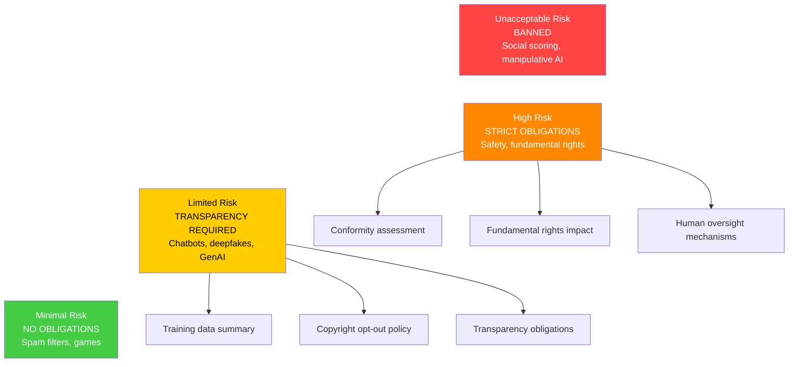

**Penalty:** Up to 15M EUR or 3% of global annual revenue.

**Code example:**

```python
from ai_use_case_context.compliance import (
    EUAIActChecklist, RiskClassification,
)

eu = EUAIActChecklist(
    risk_classification=RiskClassification.LIMITED,
    eu_distribution_planned=True,
    training_data_summary_published=True,
    copyright_opt_out_policy=True,
    transparency_obligations=True,
)

print(f"Applicable: {eu.applicable}")   # True
print(f"Compliant: {eu.compliant}")     # True
print(f"Gaps: {eu.gaps}")               # []
```

### 1.4 MovieLabs OMC 2030 Vision

Cloud-native, software-defined production workflows.

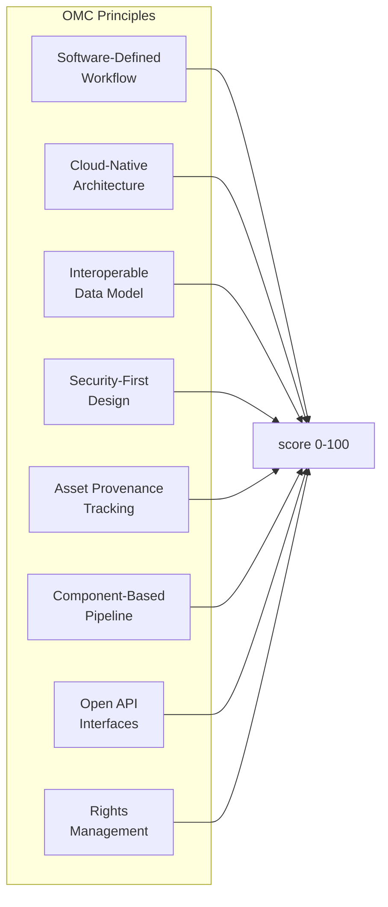

### 1.5 Composite Evaluation

```python
from ai_use_case_context.compliance import (
    ComplianceProfile, evaluate_compliance,
)

profile = ComplianceProfile(
    iso42001=iso_assessment,
    nist_ai_rmf=nist_mapping,
    eu_ai_act=eu_checklist,
    movielabs_omc=omc_alignment,
    assessor="AI Governance Board",
)

result = evaluate_compliance(profile)
print(f"Overall: {result.overall_score:.1f}/100")
for section, score in result.section_scores.items():
    print(f"  {section}: {score:.1f}")
for gap in result.gaps:
    print(f"  GAP: {gap}")
```

---

## 2. Data Provenance Module

**Module:** `ai_use_case_context/provenance.py`

Tracks data lineage from source through transformation to versioned
dataset, with model collapse prevention guards.

### 2.1 Lineage Data Model

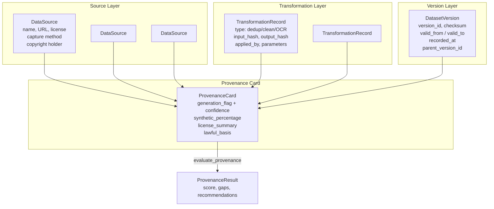

### 2.2 Generation Flag Classification

Content origin is classified with a confidence score rather than a
binary tag, acknowledging real-world ambiguity.

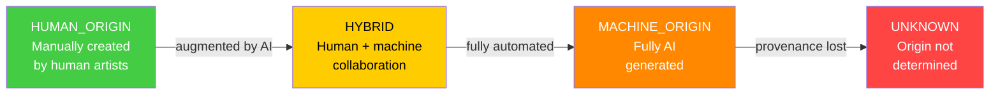

Each flag includes a `generation_confidence` score (0.0-1.0). Provenance
is considered incomplete if the flag is `UNKNOWN` with confidence below 0.8.

### 2.3 Capture Methods

| Method | Enum | Description |
|--------|------|-------------|
| Motion capture | `MOTION_CAPTURE` | MoCap suit/stage recordings |
| LIDAR | `LIDAR` | Laser scanning point clouds |
| Volumetric | `VOLUMETRIC` | Multi-camera volumetric capture |
| FACS | `FACS` | Facial Action Coding System |
| Photogrammetry | `PHOTOGRAMMETRY` | Photo-based 3D reconstruction |
| Web crawl | `CRAWL` | Scraped from web sources |
| Partner feed | `PARTNER_FEED` | Licensed partner data feed |
| Sensor | `SENSOR` | IoT / physical sensor data |
| Manual creation | `MANUAL_CREATION` | Hand-crafted by artists |
| Licensed dataset | `LICENSED_DATASET` | Purchased / licensed datasets |
| API | `API` | Retrieved via API |
| Synthetic | `SYNTHETIC` | AI-generated synthetic data |
| User submission | `USER_SUBMISSION` | User-uploaded content |

### 2.4 Bi-Temporal Lineage

Bi-temporal lineage allows reconstructing the dataset state at any
historical moment for audit purposes.

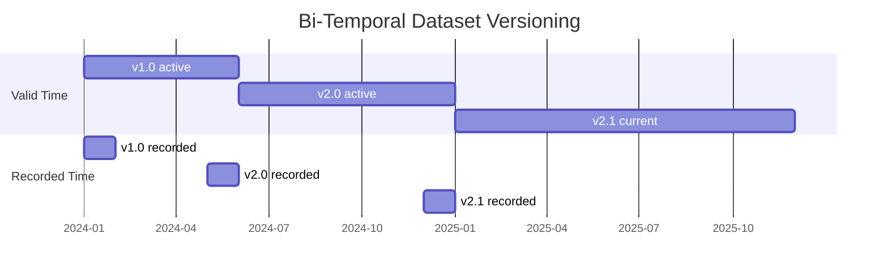

- **valid_from / valid_to**: when this version was the active dataset version
- **recorded_at**: when the version record was created in the system
- **parent_version_id**: links to the predecessor for full lineage chain

### 2.5 Model Collapse Prevention

Model collapse occurs when AI trains on outputs from other AI models,
causing quality degradation over generations.

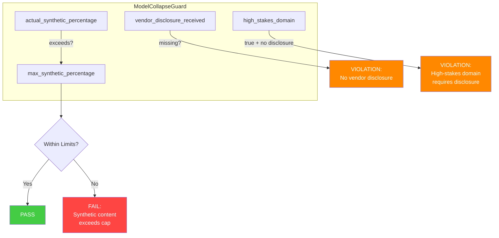

### 2.6 Provenance Scoring Breakdown

`evaluate_provenance()` scores on a 0-100 scale across six areas:

| Area | Weight | What is measured |
|------|--------|-----------------|
| Source metadata | 30 pts | Name, license, capture method, collection date, compliance status |
| License compliance | 20 pts | Percentage of sources with `VERIFIED` license compliance |
| Generation flags | 15 pts | Origin classified (10 pts) + confidence >= 0.8 (5 pts) |
| Transformation logs | 15 pts | At least one transformation recorded |
| Dataset versioning | 10 pts | At least one version with bi-temporal fields |
| Opt-out compliance | 10 pts | All copyright holders' opt-out requests honored |

### 2.7 Code Example

```python
from ai_use_case_context.provenance import (
    DataSource, CaptureMethod, LicenseCompliance,
    GenerationFlag, TransformationRecord, TransformationType,
    DatasetVersion, ProvenanceCard, ModelCollapseGuard,
    evaluate_provenance,
)
from datetime import datetime

# Define sources
source = DataSource(
    name="Licensed MoCap Library",
    license_type="Commercial Perpetual",
    license_compliance=LicenseCompliance.VERIFIED,
    capture_method=CaptureMethod.MOTION_CAPTURE,
    collection_date=datetime(2024, 6, 15),
    copyright_holder="Studio X",
    opt_out_honored=True,
)

# Build provenance card
card = ProvenanceCard(
    dataset_name="Hero Character MoCap v2",
    sources=[source],
    generation_flag=GenerationFlag.HUMAN_ORIGIN,
    generation_confidence=0.98,
    transformations=[
        TransformationRecord(
            TransformationType.CLEANING, "Removed noise",
            input_hash="sha256:abc", output_hash="sha256:def",
        ),
    ],
    versions=[
        DatasetVersion("v2.0", "Hero MoCap", record_count=15000),
    ],
    synthetic_percentage=0.0,
)

# Evaluate with model collapse guard
guard = ModelCollapseGuard(
    max_synthetic_percentage=20.0,
    actual_synthetic_percentage=0.0,
    vendor_disclosure_received=True,
)

result = evaluate_provenance(card, guard)
print(f"Score: {result.score:.1f}/100")
print(f"Licenses OK: {card.all_licenses_verified}")
print(f"Collapse guard: {'PASS' if guard.within_limits else 'FAIL'}")
```

---

## 3. Vendor Scorecard Module

**Module:** `ai_use_case_context/vendor_scorecard.py`

Six-dimension weighted scoring framework for AI vendor evaluation, with
KBYUTS criteria and post-Thomson Reuters copyright risk assessment.

### 3.1 Evaluation Pipeline

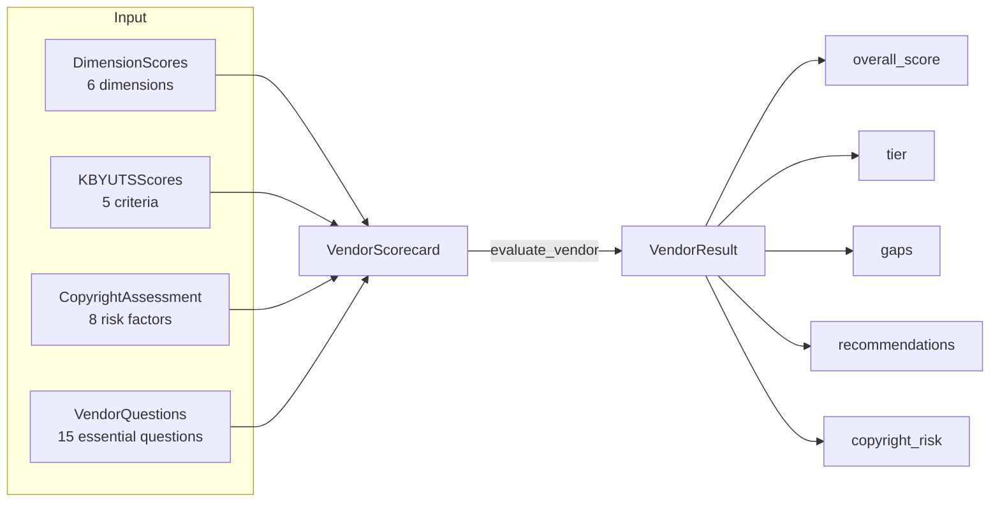

### 3.2 Six Scoring Dimensions

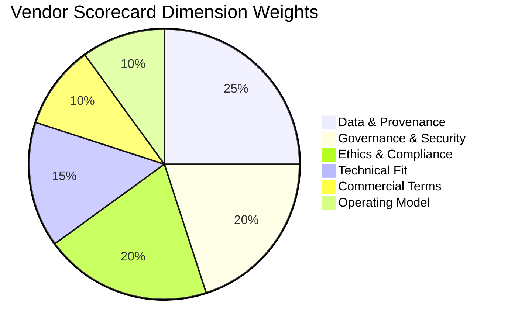

| Dimension | Weight | Key Evaluation Criteria |
|-----------|--------|------------------------|
| **Data & Provenance** | 25% | Training data transparency, lineage documentation, license compliance, consent mechanisms |
| **Governance & Security** | 20% | ISO 42001 certification, SOC 2 Type II, data isolation, incident response SLAs |
| **Ethics & Compliance** | 20% | Bias mitigation processes, ethics board, NIST AI RMF alignment, labor/talent protections |
| **Technical Fit** | 15% | Integration capabilities, API maturity, production readiness, version control |
| **Commercial Terms** | 10% | IP ownership clarity, termination rights, data portability, output ownership |
| **Operating Model** | 10% | Support model, implementation timeline, training provided, continuous monitoring |

### 3.3 Vendor Tier Classification

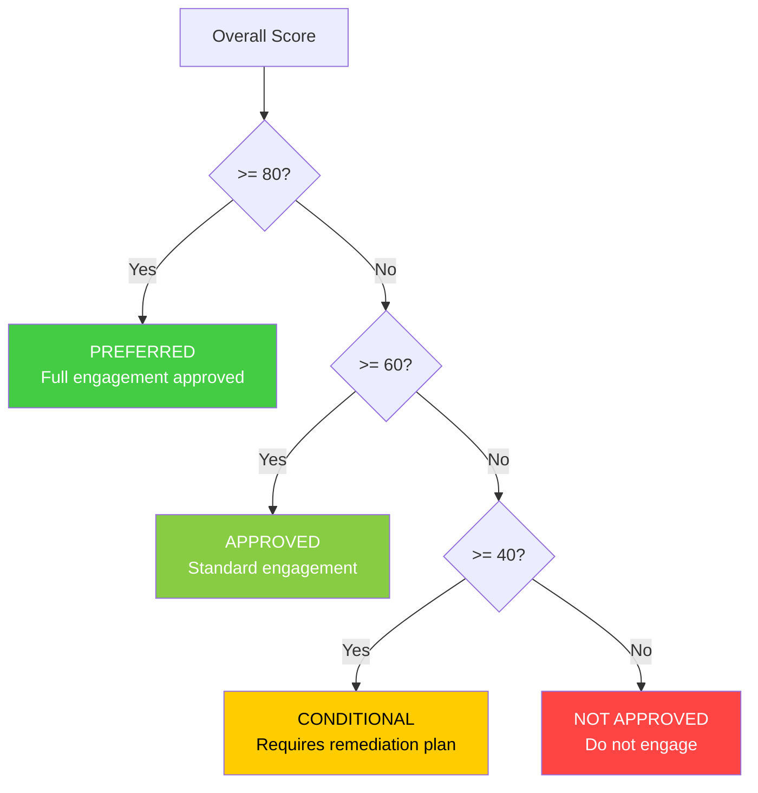

### 3.4 KBYUTS Scoring (Know Before You Use Their Stuff)

Five quantitative criteria, each scored 0-100:

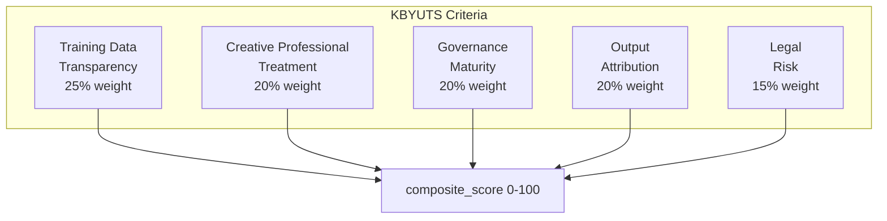

| Criterion | What it measures |
|-----------|-----------------|
| Training Data Transparency | Dataset cards, provenance docs, license clarity |
| Creative Professional Treatment | Opt-out mechanisms, consent processes, compensation |
| Governance Maturity | Certifications (ISO 42001, SOC 2), documented policies |
| Output Attribution | Ability to trace outputs to training data, audit trails |
| Legal Risk | Pending litigation, regulatory compliance, contractual protections |

### 3.5 Copyright Risk Assessment

Post-Thomson Reuters v. ROSS Intelligence (Feb 2025) decision tree:

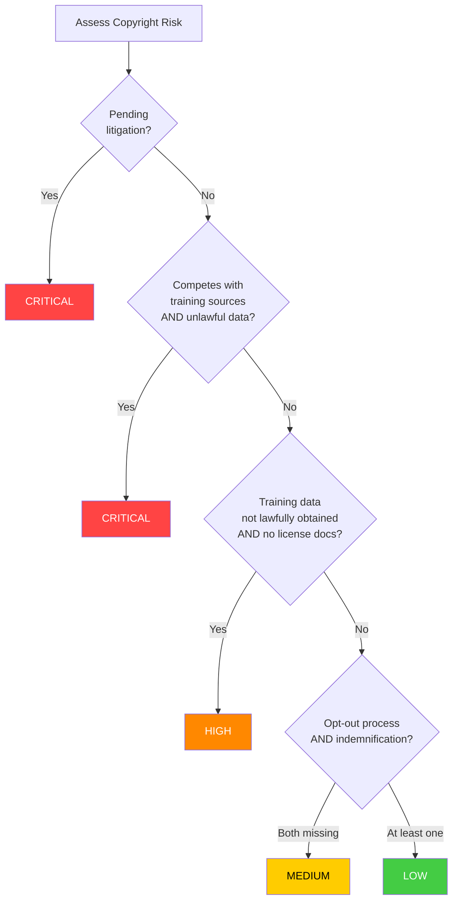

**Key factors assessed:**

- `training_data_lawfully_obtained` -- data obtained with appropriate licenses
- `license_verification_documented` -- evidence of license verification
- `opt_out_compliance_process` -- honors rights holder opt-outs (EU DSM Directive Art. 4)
- `indemnification_for_ai_outputs` -- vendor indemnifies for copyright claims
- `competes_with_training_sources` -- Thomson Reuters competitive use risk
- `pending_litigation` -- vendor has active copyright lawsuits
- `eu_dsm_article4_compliance` -- EU Digital Single Market compliance
- `eu_training_data_summary_published` -- EU AI Act GPAI summary published

### 3.6 Essential Vendor Questions

The framework includes 15 pre-built questions based on the AI Vendor
Security and Safety Assessment Guide. Loaded via `essential_vendor_questions()`:

| ID | Dimension | Question |
|----|-----------|----------|
| VQ-001 | Governance & Security | Encryption standards for data at rest and in transit? |
| VQ-002 | Governance & Security | ISO 42001 or NIST AI RMF adoption and certification? |
| VQ-003 | Governance & Security | Model testing and validation documentation? |
| VQ-004 | Ethics & Compliance | Frameworks for addressing AI bias? |
| VQ-005 | Data & Provenance | Field-level data lineage capabilities? |
| VQ-006 | Data & Provenance | Policy on using client data for model training? |
| VQ-007 | Technical Fit | Model drift monitoring and retraining policy? |
| VQ-008 | Data & Provenance | Synthetic data percentage and provenance tracking? |
| VQ-009 | Commercial Terms | Indemnification for copyright claims from AI outputs? |
| VQ-010 | Data & Provenance | Lawful acquisition of training data with licenses? |
| VQ-011 | Ethics & Compliance | Processes for honoring rights holder opt-outs? |
| VQ-012 | Commercial Terms | Does the AI compete with training data sources? |
| VQ-013 | Operating Model | Incident response SLA for AI system failures? |
| VQ-014 | Commercial Terms | Data portability upon contract termination? |
| VQ-015 | Ethics & Compliance | Training data summary per EU AI Act for GPAI? |

### 3.7 Code Example

```python
from ai_use_case_context.vendor_scorecard import (
    VendorScorecard, DimensionScore,
    KBYUTSScores, CopyrightAssessment,
    evaluate_vendor, essential_vendor_questions,
)

scorecard = VendorScorecard(
    vendor_name="NeuralForge Studio AI",
    data_provenance=DimensionScore(score=75, evidence="Dataset cards available"),
    governance_security=DimensionScore(score=82, evidence="ISO 42001 certified"),
    ethics_compliance=DimensionScore(score=68, gaps="Opt-out process immature"),
    technical_fit=DimensionScore(score=88),
    commercial_terms=DimensionScore(score=65, gaps="Indemnification capped"),
    operating_model=DimensionScore(score=78),
    kbyuts=KBYUTSScores(
        training_data_transparency=70,
        creative_professional_treatment=55,
        governance_maturity=80,
        output_attribution=45,
        legal_risk=60,
    ),
    copyright=CopyrightAssessment(
        training_data_lawfully_obtained=True,
        license_verification_documented=True,
        opt_out_compliance_process=True,
        indemnification_for_ai_outputs=True,
    ),
)

result = evaluate_vendor(scorecard)
print(f"Score: {result.overall_score:.1f}/100")
print(f"Tier: {result.tier.value}")          # -> approved
print(f"Copyright: {result.copyright_risk}") # -> low
```

---

## 4. End-to-End Workflow

A complete vendor engagement review follows seven steps. See
`examples/vendor_engagement_review.py` for a runnable implementation.

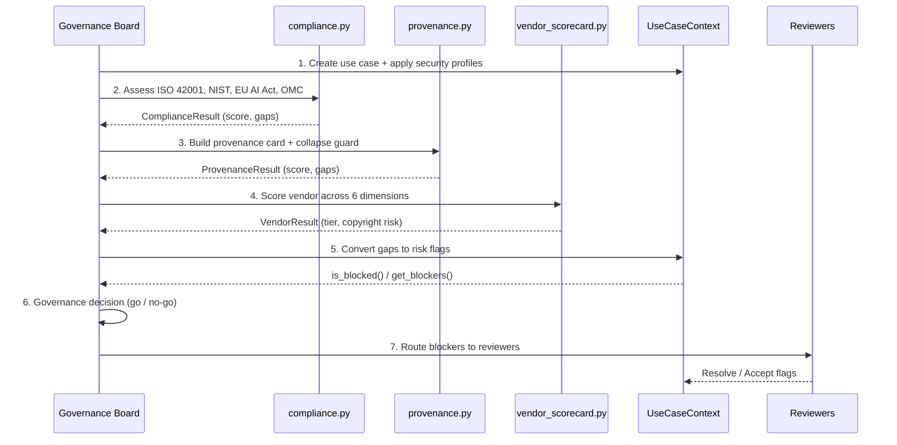

### Decision Tree

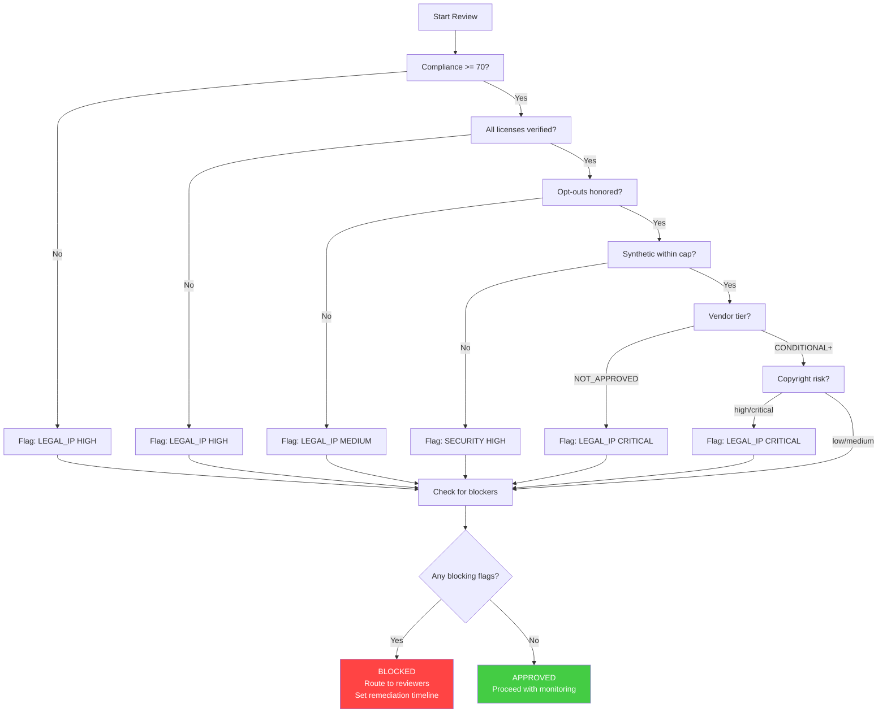

---

## 5. Integration Patterns

### 5.1 Connecting Results to Risk Flags

```python
from ai_use_case_context import UseCaseContext, RiskDimension, RiskLevel

ctx = UseCaseContext(name="AI Character Tool", workflow_phase="Asset Creation")

# From compliance evaluation
if compliance_result.overall_score < 70:
    ctx.flag_risk(
        RiskDimension.LEGAL_IP, RiskLevel.HIGH,
        f"Compliance score {compliance_result.overall_score:.0f}/100 below threshold",
    )

# From provenance evaluation
if not card.all_licenses_verified:
    ctx.flag_risk(
        RiskDimension.LEGAL_IP, RiskLevel.HIGH,
        "Training data includes sources with unverified licenses",
    )

# From vendor scorecard
if vendor_result.copyright_risk in ("high", "critical"):
    ctx.flag_risk(
        RiskDimension.LEGAL_IP, RiskLevel.CRITICAL,
        f"Vendor copyright risk: {vendor_result.copyright_risk}",
    )

# Check decision
if ctx.is_blocked():
    print(f"BLOCKED: {len(ctx.get_blockers())} issues")
    print(f"Reviewers needed: {ctx.get_reviewers_needed()}")
```

### 5.2 Audit Logging with GovernanceHooks

```python
from ai_use_case_context import (
    register_hook, AuditLogger, emit_governance_event,
    GovernanceEvent, GovernanceEventType,
)

logger = AuditLogger()
register_hook(logger)

# Emit custom events for governance review milestones
emit_governance_event(GovernanceEvent(
    event_type=GovernanceEventType.COMPLIANCE_CHECK,
    use_case_name="AI Character Tool",
    description=f"Compliance evaluation: {compliance_result.overall_score:.0f}/100",
    metadata=compliance_result.to_dict(),
))

# Query the audit log
entries = logger.query(event_type=GovernanceEventType.COMPLIANCE_CHECK)
```

### 5.3 Combining with Security Profiles

```python
from ai_use_case_context.security import security_profile, apply_security_profile

# Apply TPN + VFX security to the use case
profile = security_profile("tpn", "vfx")
apply_security_profile(ctx, profile)

# Now vendor security flags route to the correct reviewers
ctx.flag_risk(
    VFX_VENDOR_SECURITY, RiskLevel.HIGH,
    "Vendor data isolation controls unverified",
)
# -> Routed to: VP Procurement + CISO
```

### 5.4 JSON Serialization

All new dataclasses support `to_dict()` / `from_dict()` round-trip:

```python
import json

# Serialize review artifacts
artifacts = {
    "compliance": compliance_result.to_dict(),
    "provenance": provenance_result.to_dict(),
    "vendor": vendor_result.to_dict(),
    "provenance_card": card.to_dict(),
    "scorecard": scorecard.to_dict(),
}

# Write to file
with open("review_artifacts.json", "w") as f:
    json.dump(artifacts, f, indent=2)

# Reconstruct from JSON
from ai_use_case_context.compliance import ComplianceResult
from ai_use_case_context.vendor_scorecard import VendorResult

restored_compliance = ComplianceResult.from_dict(artifacts["compliance"])
restored_vendor = VendorResult.from_dict(artifacts["vendor"])
```

### 5.5 Portfolio Dashboard

```python
from ai_use_case_context import GovernanceDashboard

dashboard = GovernanceDashboard()
dashboard.register(ctx)

# Portfolio-level views
for name, scores in dashboard.portfolio_risk_scores().items():
    print(f"{name}: {scores}")

# Reviewer workload
for reviewer, flags in dashboard.reviewer_workload().items():
    print(f"{reviewer}: {len(flags)} flags")
```

---

## 6. Quick Reference

### Classes

| Class | Module | Purpose |
|-------|--------|---------|
| `ISO42001Assessment` | compliance | ISO 42001 AIMS assessment with Annex A controls |
| `ISO42001Control` | compliance | Single Annex A control checklist item |
| `NISTAIRMFMapping` | compliance | NIST AI RMF four-function alignment |
| `NISTSubcategory` | compliance | Single NIST subcategory assessment |
| `EUAIActChecklist` | compliance | EU AI Act compliance checklist |
| `MovieLabsOMCAlignment` | compliance | MovieLabs OMC 2030 alignment |
| `ComplianceProfile` | compliance | Composite profile aggregating all standards |
| `ComplianceResult` | compliance | Scored evaluation output |
| `DataSource` | provenance | Source-level metadata (URL, license, capture method) |
| `TransformationRecord` | provenance | Single data transformation log entry |
| `DatasetVersion` | provenance | Bi-temporal versioned dataset snapshot |
| `ProvenanceCard` | provenance | Human-readable provenance summary |
| `ModelCollapseGuard` | provenance | Synthetic data cap enforcement |
| `ProvenanceResult` | provenance | Scored provenance evaluation output |
| `VendorScorecard` | vendor_scorecard | Complete vendor evaluation document |
| `DimensionScore` | vendor_scorecard | Single dimension score (0-100) |
| `KBYUTSScores` | vendor_scorecard | Five KBYUTS quantitative criteria |
| `CopyrightAssessment` | vendor_scorecard | Copyright risk evaluation |
| `VendorQuestion` | vendor_scorecard | Single vendor assessment question |
| `VendorResult` | vendor_scorecard | Scored vendor evaluation output |

### Evaluation Functions

| Function | Input | Output | Description |
|----------|-------|--------|-------------|
| `evaluate_compliance()` | `ComplianceProfile` | `ComplianceResult` | Scores all standards, identifies gaps |
| `evaluate_provenance()` | `ProvenanceCard`, `ModelCollapseGuard?` | `ProvenanceResult` | Scores lineage completeness |
| `evaluate_vendor()` | `VendorScorecard`, weights?, thresholds? | `VendorResult` | Weighted scoring with tier assignment |

### Template Helpers

| Function | Returns | Description |
|----------|---------|-------------|
| `iso42001_annex_a_controls()` | `list[ISO42001Control]` | 25 blank Annex A control templates |
| `nist_ai_rmf_subcategories()` | `list[NISTSubcategory]` | 19 NIST subcategory templates (GV/MP/MS/MG) |
| `essential_vendor_questions()` | `list[VendorQuestion]` | 15 essential vendor assessment questions |

### Enums

| Enum | Values |
|------|--------|
| `RiskClassification` | `UNACCEPTABLE`, `HIGH`, `LIMITED`, `MINIMAL` |
| `AIMSMaturity` | `INITIAL`, `MANAGED`, `DEFINED`, `QUANTITATIVELY_MANAGED`, `OPTIMIZING` |
| `NISTFunction` | `GOVERN`, `MAP`, `MEASURE`, `MANAGE` |
| `OMCWorkflowPhase` | `CONCEPT`, `PRE_PRODUCTION`, `PRODUCTION`, `POST_PRODUCTION`, `DISTRIBUTION`, `ARCHIVE` |
| `GenerationFlag` | `HUMAN_ORIGIN`, `MACHINE_ORIGIN`, `HYBRID`, `UNKNOWN` |
| `CaptureMethod` | `CRAWL`, `PARTNER_FEED`, `MOTION_CAPTURE`, `LIDAR`, `FACS`, `PHOTOGRAMMETRY`, ... |
| `TransformationType` | `DEDUPLICATION`, `CLEANING`, `OCR`, `TRANSLATION`, `AUGMENTATION`, ... |
| `LicenseCompliance` | `VERIFIED`, `PENDING_REVIEW`, `NON_COMPLIANT`, `UNKNOWN`, `NOT_APPLICABLE` |
| `ScorecardDimension` | `DATA_PROVENANCE`, `GOVERNANCE_SECURITY`, `ETHICS_COMPLIANCE`, `TECHNICAL_FIT`, `COMMERCIAL_TERMS`, `OPERATING_MODEL` |
| `VendorTier` | `PREFERRED` (>=80), `APPROVED` (>=60), `CONDITIONAL` (>=40), `NOT_APPROVED` (<40) |
